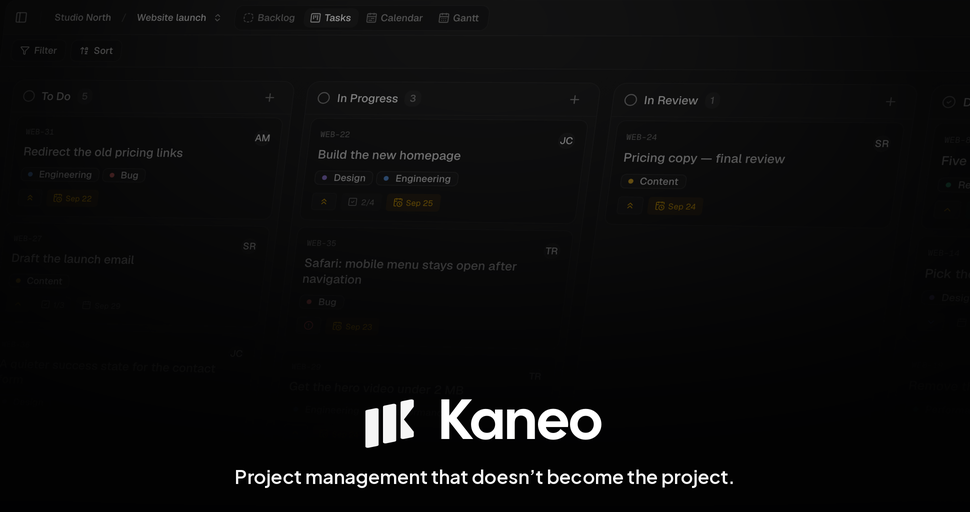
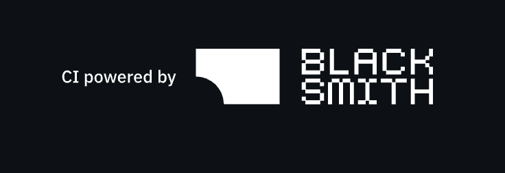

  

[![AI Policy: Human Voice](https://img.shields.io/badge/AI_Policy-Human_Voice-blue?logo=data:image%2Fsvg%2Bxml;base64,PHN2ZyB4bWxucz0iaHR0cDovL3d3dy53My5vcmcvMjAwMC9zdmciIHZpZXdCb3g9IjAgMCAyNCAyNCIgd2lkdGg9IjI0IiBoZWlnaHQ9IjI0Ij4KICA8c3R5bGU%2BCiAgICAuaWNvbiB7CiAgICAgIGZpbGw6IG5vbmU7CiAgICAgIHN0cm9rZTogIzAwMDAwMDsKICAgICAgc3Ryb2tlLXdpZHRoOiAyLjI1OwogICAgICBzdHJva2UtbGluZWNhcDogcm91bmQ7CiAgICAgIHN0cm9rZS1saW5lam9pbjogcm91bmQ7CiAgICB9CiAgICBAbWVkaWEgKHByZWZlcnMtY29sb3Itc2NoZW1lOiBkYXJrKSB7CiAgICAgIC5pY29uIHsgc3Ryb2tlOiAjZmZmZmZmOyB9CiAgICB9CiAgPC9zdHlsZT4KICA8cGF0aCBjbGFzcz0iaWNvbiIgZD0iTTE5LjQxNCAxNC40MTRDMjEgMTIuODI4IDIyIDExLjUgMjIgOS41YTUuNSA1LjUgMCAwIDAtOS41OTEtMy42NzYuNi42IDAgMCAxLS44MTguMDAxQTUuNSA1LjUgMCAwIDAgMiA5LjVjMCAyLjMgMS41IDQgMyA1LjVsNS41MzUgNS4zNjJhMiAyIDAgMCAwIDIuODc5LjA1MiAyLjEyIDIuMTIgMCAwIDAtLjAwNC0zIDIuMTI0IDIuMTI0IDAgMSAwIDMtMyAyLjEyNCAyLjEyNCAwIDAgMCAzLjAwNCAwIDIgMiAwIDAgMCAwLTIuODI4bC0xLjg4MS0xLjg4MmEyLjQxIDIuNDEgMCAwIDAtMy40MDkgMGwtMS43MSAxLjcxYTIgMiAwIDAgMS0yLjgyOCAwIDIgMiAwIDAgMSAwLTIuODI4bDIuODIzLTIuNzYyIi8%2BCjwvc3ZnPgo%3D)](https://github.com/usekaneo/kaneo/blob/main/AI_POLICY.md)

  <h3>
    <a href="https://cloud.kaneo.app">Cloud</a>
     | 
    <a href="https://kaneo.app/docs/core/installation">Installation</a>
     | 
    <a href="https://kaneo.app">Website</a>
     | 
    <a href="https://discord.gg/rU4tSyhXXU">Discord</a>
  </h3>

  Fast, simple, open-source project management.

  

## Built for your team's work

- **See work your way:** Board, List, Calendar, and Gantt views, plus a backlog, filters, and search.
- **Keep task context together:** descriptions, attachments, subtasks, dependencies, labels, comments, and time tracking.
- **Work with your team:** shared workspaces, invitations, custom roles, live updates, and public project views.
- **Shape your workflow:** custom columns and fields, with rules that move tasks when repository activity changes.
- **Stay informed:** in-app notifications, email, ntfy, Gotify, and personal webhooks.
- **Connect other tools:** GitHub and Gitea, chat integrations, project webhooks, a [REST API](https://kaneo.app/docs/api-reference/introduction), and [MCP](https://kaneo.app/docs/core/integrations/mcp) for AI assistants.

## Installation

- **Cloud:** [Get started with Kaneo Cloud](https://cloud.kaneo.app).
- **Self-hosted:** Follow the [installation guide](https://kaneo.app/docs/core/installation).

## Contributing

Code, translations, documentation, and bug reports are welcome. Start with the [contributing guide](CONTRIBUTING.md) and [local development setup](ENVIRONMENT_SETUP.md). Pay particular attention to [contribution eligibility](https://github.com/usekaneo/kaneo/blob/main/CONTRIBUTING.md#contribution-eligibility).

Join us on [Discord](https://discord.gg/rU4tSyhXXU) or share bugs and feature requests in [GitHub Issues](https://github.com/usekaneo/kaneo/issues).

## Sponsors

Kaneo is open source. If you find it useful, consider [sponsoring the project](https://github.com/sponsors/andrejsshell) to help support ongoing development.

### Partners

  

This project is tested with BrowserStack.

### Community sponsors

<!-- sponsors --><!-- sponsors -->

## License

MIT License - see [LICENSE](LICENSE) for details.

---

  

  Built with ❤️ by the Kaneo team and <a href="https://github.com/usekaneo/kaneo/graphs/contributors">contributors</a>

